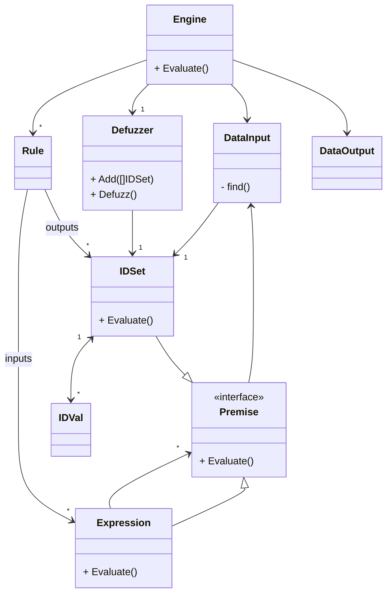

# fugologic

Fugologic is a naive implementation of a fuzzy logic system.

## Getting started

For more example, see [/fugologic/fuzzy/engine_test.go](https://github.com/sbiemont/fugologic/blob/master/fuzzy/engine_test.go)

## Define the system

### Crisp values definition

Defuzzification requires a crisp interval of discrete values.

It is defined as `crisp.Set` (x min, x max, dx)

### Fuzzy values definition

Inputs and outputs are defined as:

* `fuzzy.IDVal`: a fuzzy value that contains,
  * an identifier
  * a list of fuzzy sets (only required for system checks)
  * a crisp interval of values (only required for defuzziing)
* `fuzzy.IDSet`: fuzzy set that contains,
  * an identifier
  * a membership method
  * its parent `fuzzy.IDVal`

*Notes* :

* every identifier shall be unique
* `fuzzy.IDVal` and `fuzzy.IDSet` can be defined using a random generate ID or a custom one

### Define fuzzy inputs / outputs

First, create a fuzzy value and link it to a list of fuzzy sets.

Ensure that the crisp interval of the fuzzy value covers the fuzzy sets intervals.

```go
// Fuzzy value "a"
fvA := fuzzy.NewIDValCustom("a", crisp.NewSetDx(-3, 3, 0.1))

// Fuzzy sets "a1", "a2"
fsA1 := fuzzy.NewIDSetCustom("a1", fuzzy.NewSetTriangular(-3, -1, 1), &fvA)
fsA2 := fuzzy.NewIDSetCustom("a2", fuzzy.NewSetTriangular(-1, 1, 3), &fvA)
```

Create other inputs and outputs the same way.

### Define the rules

To define the rules system:

```raw
rule = <expression> <implication> <consequence>
rule = A1 and B1    then          C1, D1
```

* `expression` : connect several fuzzy sets together
* `implication` : define a implication method
* `conseqence` : defines several fuzzy sets as the outputs

#### Describe an input expression

Choose the input fuzzy sets and link them using a connector.

Simplest case : the expression has only one premise (directly use the fuzzy set)

```go
// A1
exp := fsA1
```

An expression can be a flat list of several fuzzy sets linked with the same connector.
For example : `A1 and B1 and C1`

```go
// A1 and B1 and C1
exp := fuzzy.NewExpression([]fuzzy.Premise{fsA1, fsB1, fsC1}, fuzzy.ConnectorAnd)
```

At last, an expression can be more complex like `(A1 and B1 and C1) or (D1 and E1)`.

```go
// A1 and B1 and C1
expABC := fuzzy.NewExpression([]fuzzy.Premise{fsA1, fsB1, fsC1}, fuzzy.ConnectorAnd)

// D1 and E1
expDE := fuzzy.NewExpression([]fuzzy.Premise{fsD1, fsE1}, fuzzy.ConnectorAnd)

// (A1 and B1 and C1) or (D1 and E1)
exp := fuzzy.NewExpression([]fuzzy.Premise{expABC, expDE}, fuzzy.ConnectorOr)
```

#### Describe an implication

An implication links the input expression and the ouput consequence.
Several methods can be chosen like:

* `ImplicationProd` : Mamdani implication product
* `ImplicationMin`
* ...

#### Describe an output consequence

A consequence is just a list of fuzzy sets.

#### Write a rule

Combine the several items previously seen to describe the rules system:

```go
rules := []fuzzy.Rule{
  // A1 and B1 => C1
  fuzzy.NewRule(
    fuzzy.NewExpression([]fuzzy.Premise{fsA1, fsB1}, fuzzy.ConnectorAnd), // expression
    fuzzy.ImplicationProd,                                                // mamdani implication product
    []fuzzy.IDSet{fsC1},                                                  // consequence
  ),
  // Describe other rules, for example:
  //  * A1 and B2 => C2
  //  * A2 and B1 => C1
  //  * A2 and B2 => C2
}
```

### Choose a defuzzing method

Create a defuzzer with a specific method (like the centroïd method)

```go
defuzzer := fuzzy.NewDefuzzer(fuzzy.DefuzzificationCentroid)
```

### Create an engine

A fuzzy system engine combines the whole rules system and a defuzzer.

#### Engine new instance

If the rules contains an error, the engine builder will fail.

```go
engine, err := fuzzy.NewEngine(rules, defuzzer)
if err != nil {
  // An error occurred, check the rules
  return err
}
```

#### Engine evaluation

Then, launch the evaluation process by setting a new input value for each `IDVal` of the system.

The result contains a crisp value for each fuzzy output value defined.

```go
// Evaluation of the rule "A1 and B1 => C1"
result, err := engine.Evaluate(fuzzy.DataInput{
  "a": 1,
  "b": 0.05,
})
if err != nil {
  return err
}

// Result
// fuzzy.DataOutput{
//   "c": <crisp result>,
// }
```

## Class diagram

Classes used to describe and evaluate a simple fuzzy system


