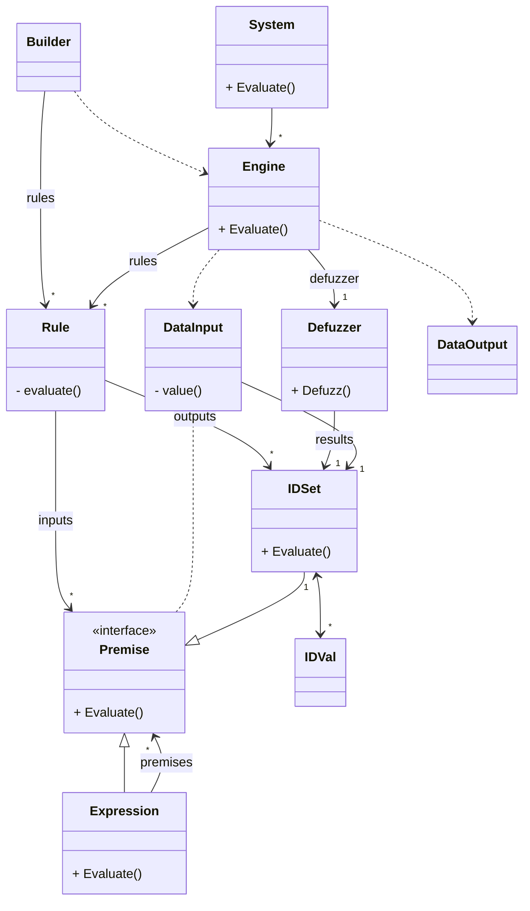

# fugologic

Fugologic is a basic implementation of a fuzzy logic system.

## TL;DR

Define fuzzy values, create the rules and evaluate them.

* Describe complex rules manually or using a builder
* Describe simple rules using specific methods (like the [fuzzy associative matrix](https://en.wikipedia.org/wiki/Fuzzy_associative_matrix))

For example, implement the following rules

HP/FP => Act | Very low HP | Low HP   | Medium HP | High HP      | Very high HP
-------------|-------------|----------|-----------|--------------|-------------
**Very weak FP** | Retreat! | Retreat! | Defend   | Defend       | Defend
**Weak FP**      | Retreat! | Defend   | Defend   | Attack       | Attack
**Medium FP**    | Retreat! | Defend   | Attack   | Attack       | Full attack!
**High FP**      | Retreat! | Defend   | Attack   | Attack       | Full attack!
**Very high FP** | Defend   | Attack   | Attack   | Full attack! | Full attack!

```go
// Create a crisp set, fuzzy sets and a fuzzy value
// Input HP [0 ; 100]
crispHP, _ := crisp.NewSetN(0, 100, 1000)
fsHP, _ := fuzzy.NewIDSets(map[id.ID]fuzzy.SetBuilder{
  "Very low HP":  fuzzy.StepDown{A: 0, B: 20},
  "Low HP":       fuzzy.Trapezoid{A: 0, B: 20, C: 40, D: 60},
  "Medium HP":    fuzzy.Triangular{A: 40, B: 50, C: 60},
  "High HP":      fuzzy.Trapezoid{A: 40, B: 60, C: 80, D: 100},
  "Very high HP": fuzzy.StepUp{A: 80, B: 100},
})
fvHP, _ := fuzzy.NewIDVal("HP", crispHP, fsHP)

// Create other fuzzy values the same way
// * fvFP  [0 ; 100]:  "Very weak FP", "Weak FP", "Medium FP", "High FP", "Very high FP"
// * fvAct [-10 ; 10]: "Retreat!", "Defend", "Attack", "Full attack!"

// Express all rules using the "fuzzy associative matrix"
// if <HP> and <FP> then <Act>
bld := builder.Mamdani().FuzzyAssoMatrix()
_ = bld.
  Asso(fvHP, fvFP, fvAct).
  Matrix(
    []id.ID{"Very low HP", "Low HP", "Medium HP", "High HP", "Very high HP"},
    map[id.ID][]id.ID{
      "Very weak FP": {"Retreat!", "Retreat!", "Defend", "Defend", "Defend"},
      "Weak FP":      {"Retreat!", "Defend", "Defend", "Attack", "Attack"},
      "Medium FP":    {"Retreat!", "Defend", "Attack", "Attack", "Full attack!"},
      "High FP":      {"Retreat!", "Defend", "Attack", "Attack", "Full attack!"},
      "Very high FP": {"Defend", "Attack", "Attack", "Full attack!", "Full attack!"},
    },
  )

// Create an engine and evaluate it
engine, _ := bld.Engine()
result, _ := engine.Evaluate(fuzzy.DataInput{
  fvHP: 75,
  fvFP: 30,
})

// Manage output
return result[fvAct]
```

## Getting started

For more examples, see [/fugologic/example/](https://github.com/sbiemont/fugologic/blob/master/example/)

## Define the system

### Crisp values definition

Defuzzification requires a crisp interval of discrete values.

It is defined as `crisp.Set` (x min, x max, dx)

```go
// Each values from 0.0 to 0.3 every 0.1 => [0.0, 0.1, 0.2, 0.3]
set, err := crisp.NewSet(0.0, 0.3, 0.1)
if err != nil{
  return err
}
```

It can also be defined with n values (x min, x max, n values)

```go
// 4 values in [0.0 ; 0.3]
set, err := crisp.NewSetN(0.0, 0.3, 4)
if err != nil{
  return err
}
```

### Membership function definition

A membership function is defined as a `fuzzy.Set`.
Several methods are proposed, like :

method | description | shape
------ | ----------- | -----
`Gauss`      | Gaussian                | ▁/⁀\▁
`Gbell`      | Generalized bell-shaped | ▁/⁀\▁
`Trapezoid`  | Trapezoïdal             | ▁/▔\▁
`Triangular` | Triangular              | ▁/\▁
`StepUp`     | Step up (S shape)       | ▁/▔
`StepDown`   | Step down (Z shape)     | ▔\▁

Initialise a builder and call `New` to get the `fuzzy.Set` and check for errors

```go
set, err := Triangular{A: 1, B: 2, C: 3}.New()
if err != nil {
  return err
}
```

### Fuzzy values definition

Fuzzy values and fuzzy sets are defined as :

* `fuzzy.IDVal`: a fuzzy value that contains,
  * an identifier `id.ID`
  * a `crisp.Set` interval of values (required for defuzzification)
  * a list of `fuzzy.IDSet` ; and each on contains,
    * an identifier `id.ID`
    * a membership method `fuzzy.Set`
    * its `fuzzy.IDVal` parent

*Notes* : every identifier shall be unique in a `fuzzy.Engine`

### Define fuzzy inputs / outputs

First, create a fuzzy value and link it to a list of fuzzy sets.

Ensure that the crisp interval of the fuzzy value covers all the fuzzy sets intervals.

```go
// Fuzzy sets "a1", "a2"
// Use the builder or create them manually
fsA, _ := fuzzy.NewIDSets(map[id.ID]fuzzy.SetBuilder{
  "a1": fuzzy.Triangular{-3, -1, 1},
  "a2": fuzzy.Trapezoid{-1, 1, 3, 5},
})

// Fuzzy value "a"
crispA, _ := crisp.NewSet(-3, 5, 0.1)
fvA, _ := fuzzy.NewIDVal("a", crispA, fsA)

// Retrieve fuzzy sets using their ids
fsA1 := fvA.Get("a1")
fsA2 := fvA.Get("a2")

// Or fetch a fuzzy set and its presence
// - fsUnknown is empty
// - ok is false
fsUnknown, ok := fvA.Fetch("unknown")
```

Create other inputs and outputs the same way.

### Define the rules

A rule is defined with 3 components :

* `expression` : connects several fuzzy sets together
* `implication` : defines an implication method
* `consequence` : defines several fuzzy sets as the outputs

```raw
rule = <expression> <implication> <consequence>
rule = A1 and B1    then          C1, D1
```

#### Use a rule builder

The rule builder is optional but helps creating simple rules, and then, an engine.

Use a predefined configuration, and then create a builder

```go
cfg := builder.Mamdani() // Predefined configuration
bld := cfg.FuzzyLogic()  // Rule builder using the predefined configuration
```

Or create a custom configuration, and then create a builder

```go
cfg := builder.Config{
  Optr:   fuzzy.OperatorZadeh{},
  Impl:   fuzzy.ImplicationMin,
  Agg:    fuzzy.AggregationUnion,
  Defuzz: fuzzy.DefuzzificationCentroid,
}
bld := cfg.FuzzyLogic()
```

Or use your configuration to created the wanted builder

```go
bld := builder.NewFuzzyLogic(
  fuzzy.OperatorZadeh{},
  fuzzy.ImplicationMin,
  fuzzy.AggregationUnion,
  fuzzy.DefuzzificationCentroid,
)
```

Details of the configuration parameters

type | example | description
---- | ------- | -----------
**`fuzzy.Operator`**    || connect several rule premises together to create an expression
|| `OperatorZadeh`      | Zadeh `And`, `Or`, `XOr` connectors
|| `OperatorHyperbolic` | Hyperbolic `And`, `Or`, `XOr` connectors
**`fuzzy.Implication`** || propagates the expression results into consequences
|| `ImplicationMin`     | Mamdani implication minimum
|| `ImplicationProd`    | Sugeno implication product
**`fuzzy.Aggregation`**      || merges all coherent implications
|| `AggregationUnion`        | union
|| `AggregationIntersection` | intersection
**`fuzzy.Defuzzification`**        || extracts one value from the aggregated results
|| `DefuzzificationCentroid`       | centroïd: center of gravity
|| `DefuzzificationBisector`       | bisector: position under the curve where the areas on both sides are equal
|| `DefuzzificationSmallestOfMaxs` | if several `y` maximums are found, get the one with the smallest `x`
|| `DefuzzificationMiddleOfMaxs`   | if several `y` maximums are found, get the point at the middle of the smallest and the largest `x`
|| `DefuzzificationLargestOfMaxs`  | if several `y` maximums are found, get the one with the largest `x`

#### Describe an input expression

Select the input `fuzzy.IDSet` and link them using a `fuzzy.Operator`.

Simplest case : the expression has only one premise and no connector (directly use the fuzzy set)

```go
// A1
exp := fsA1
```

An expression is a flat list of several `fuzzy.IDSet` linked with the same `fuzzy.Connector`.

For example : `A1 and B1 not C1`.

```go
// Using a builder
// A1 and B1 and C1
exp := bld.If(fsA1).And(fsB1).And(fsC1)
```

Or in a more explicit way

```go
// Using explicit syntax
// A1 and B1 and C1
exp := fuzzy.NewExpression([]fuzzy.Premise{fsA1, fsB1, fsC1}, fuzzy.OperatorZadeh{}.And)
```

At last, an expression can be more complex like `(A1 and B1 and C1) not-or (D1 and E1)`.

*Note* : an expression can be complemented using the `Not` function

```go
// Using a builder
expABC := bld.If(fsA1).And(fsB1).And(fsC1) // A1 and B1 and C1
expDE := bld.If(fsD1).And(fsE1)            // D1 and E1
exp := expABC.Or(expDE).Not()              // (A1 and B1 and C1) not-or (D1 and E1)
```

Or in a more explicit way

```go
// Using explicit syntax
expABC := fuzzy.NewExpression([]fuzzy.Premise{fsA1, fsB1, fsC1}, fuzzy.OperatorZadeh{}.And) // A1 and B1 and C1
expDE := fuzzy.NewExpression([]fuzzy.Premise{fsD1, fsE1}, fuzzy.OperatorZadeh{}.And)        // D1 and E1
exp := fuzzy.NewExpression([]fuzzy.Premise{expABC, expDE}, fuzzy.OperatorZadeh{}.Or).Not()  // (A1 and B1 and C1) not-or (D1 and E1)
```

#### Describe an implication

An implication links the input expression and the ouput consequences (using a `fuzzy.Implication`)

#### Describe an output consequence

A consequence is just a list of `fuzzy.IDSet`.

#### Write a rule

Combine several items previously seen to describe the rules.

##### Write a rule manually

This method can be used to easily generate rules manually.
Connectors can be explicitely choosen, unlike for the first method.

*Note* : create a list of rules to use it afterwards.

```go
// Using explicit syntax, the rule has to be part of a list
rules := []fuzzy.Rule{
  // A1 and B1 => C1
  fuzzy.NewRule(
    fuzzy.NewExpression([]fuzzy.Premise{fsA1, fsB1}, fuzzy.OperatorZadeh{}.And), // expression
    fuzzy.ImplicationMin,                                                        // implication
    []fuzzy.IDSet{fsC1},                                                         // consequence
  ),
  // Describe other rules the same way, for example:
  //  * A1 and B2 => C2
  //  * A2 and B1 => C1
  //  * A2 and B2 => C2
}
```

##### Write a rule using a builder

This method is useful when describing rules directly in the code (using a builder)

*Note* : the builder that creates a rule stores it.

```go
// Using a builder, the rule is stored in the builder
bld := Mamdani().FuzzyLogic()
// A1 and B1 => C1
bld.If(fsA1).And(fsB1).Then(fsC1)
// Describe other rules the same way
// ...
```

##### Write rules using a fuzzy associative matrix

This method allows compact description of all rules using a
[fuzzy associative matrix](https://en.wikipedia.org/wiki/Fuzzy_associative_matrix)

*Notes* :

* it can only be used to express rules like `if <a> and <b> then <c>` in a tabular form
* the first operand describe the columns values
* the second operand describes the rows values
* the last operand if the result of value of the row #i and the column #j ;
  an empty identifier means no rule

Eg.: express all rules using the following tabular form

* if `a1` and `b1` then `c1`
* if `a1` and `b2` then `c2`
* ...

| a/b => c| a1 | a2 | a3 |
|---------|----|----|----|
| **b1**  | c1 | c2 | c3 |
| **b2**  | c2 | c3 | c4 |
| **b3**  | c3 | c4 | c5 |
| **b4**  | c4 | c5 | c6 |
| **b5**  | c5 | c6 | c7 |

```go
// Express all rules using a "fuzzy associative matrix"
bld := builder.Mamdani().FuzzyAssoMatrix()
err := bld.
  Asso(fvA, fvB, fvC).
  Matrix(
    []id.ID{"a1", "a2", "a3"},
    map[id.ID][]id.ID{
      "b1": {"c1", "c2", "c3"},
      "b2": {"c2", "c3", "c4"},
      "b3": {"c3", "c4", "c5"},
      "b4": {"c4", "c5", "c6"},
      "b5": {"c5", "c6", "c7"},
    },
  )
if err != nil {
  return err
}
```

### Create an engine

A `fuzzy.Engine` evaluates a list of `fuzzy.Rule`, applies a `fuzzy.Aggregation` to get a fuzzy result, and extracts one crisp value for each output using a `fuzzy.Defuzzification` method.

#### Engine new instance

If the defined rules contains an error, the engine builder will return it.

Create an engine from the builder

```go
// Using a builder
engine, err := bld.Engine()
if err != nil {
  return err
}
```

Or create an engine manually with custom methods

```go
// Using explicit syntax
engine, err := fuzzy.NewEngine(rules, AggregationUnion, DefuzzificationCentroid)
if err != nil {
  return err
}
```

#### Engine evaluation

Then, launch the evaluation process by setting a new crisp input value for each `fuzzy.IDVal` of the engine.

The result contains a crisp value for each fuzzy output value defined.

```go
// Evaluate all the rules of the engine
result, err := engine.Evaluate(fuzzy.DataInput{
  fvA: 1,
  fvB: 0.05,
})
if err != nil {
  return err
}

// result = fuzzy.DataOutput{
//   fvC: <crisp result>,
// }
```

### Create a system

A system is an ordered list of engines.
An output of an engine can be linked to the input of another engine.

#### System new instance

When creating a system, some contraints are checked, like:

* all identifiers shall be unique
* an output shall only be produced once
* loops are forbidden : an output cannot be linked to an input of a previous engine

```go
// Create engines
engine1, _ := fuzzy.NewEngine(rules1, AggregationUnion, DefuzzificationCentroid)
engine2, _ := fuzzy.NewEngine(rules2, AggregationUnion, DefuzzificationProd)

// Create and evaluate the system
system, err := fuzzy.NewSystem([]Engine{engine1, engine2})
if err != nil {
  return err
}
```

#### System evaluation

Then, launch the evaluation process by setting a new input value for each `fuzzy.IDVal` of the system.

The result contains a crisp value for each `fuzzy.IDVal` output value defined.

```go
// Evaluation of the rules of each engines
result, err := system.Evaluate(fuzzy.DataInput{
  fvA: 1,
  fvB: 0.05,
})
if err != nil {
  return err
}

// result = fuzzy.DataOutput{
//   fvC: <crisp result>,
// }
```

## Class diagram

Classes used to describe and evaluate a simple fuzzy system


