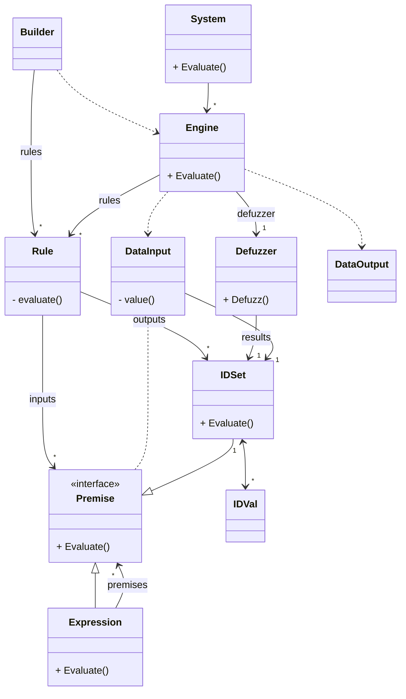

# fugologic

Fugologic is a basic implementation of a fuzzy logic system.

## Getting started

For more example, see [/fugologic/example/example_test.go](https://github.com/sbiemont/fugologic/blob/master/example/example_test.go)

## Define the system

### Crisp values definition

Defuzzification requires a crisp interval of discrete values.

It is defined as `crisp.Set` (x min, x max, dx)

```go
// Each values from 0.0 to 0.3 every 0.1 => [0.0, 0.1, 0.2, 0.3]
set, err := crisp.NewSet(0.0, 0.3, 0.1)
if err != nil{
  return err
}
```

It can also be defined with n values (x min, x max, n values)

```go
// 4 values in [0.0 ; 0.3]
set, err := crisp.NewSetN(0.0, 0.3, 4)
if err != nil{
  return err
}
```

### Membership function definition

A membership function is defined as a `fuzzy.Set`.
Several methods are proposed, like :

method | description
------ | -----------
`Gauss`      | Gaussian
`Gbell`      | Generalized bell-shaped
`Trapezoid`  | Trapezoïdal
`Triangular` | Triangular
`StepUp`     | Step up (S shape)
`StepDown`   | Step down (Z shape)

Initialise a builder and call `New` to get the `fuzzy.Set` and check for errors

```go
set, err := Triangular{A: 1, B: 2, C: 3}.New()
if err != nil {
  return err
}
```

### Fuzzy values definition

Fuzzy values and fuzzy sets are defined as :

* `fuzzy.IDVal`: a fuzzy value that contains,
  * an identifier `id.ID`
  * a `crisp.Set` interval of values (required for defuzzification)
  * a list of `fuzzy.IDSet` ; and each on contains,
    * an identifier `id.ID`
    * a membership method `fuzzy.Set`
    * its `fuzzy.IDVal` parent

*Notes* : every identifier shall be unique in a `fuzzy.Engine`

### Define fuzzy inputs / outputs

First, create a fuzzy value and link it to a list of fuzzy sets.

Ensure that the crisp interval of the fuzzy value covers all the fuzzy sets intervals.

```go
// Fuzzy sets "a1", "a2"
// Use the builder or create them manually
fsA, _ := fuzzy.NewIDSets(map[id.ID]fuzzy.SetBuilder{
  "a1": fuzzy.Triangular{-3, -1, 1},
  "a2": fuzzy.Trapezoid{-1, 1, 3, 5},
})

// Fuzzy value "a"
crispA, _ := crisp.NewSet(-3, 5, 0.1)
fvA, _ := fuzzy.NewIDVal("a", crispA, fsA)

// Retrieve fuzzy sets using their ids
fsA1 := fvA.Get("a1") // or use: fsA["a1"]
fsA2 := fvA.Get("a2") // or use: fsA["a2"]

// Or fetch a fuzzy set and its presence
// - fsUnknown is empty
// - ok is false
fsUnknown, ok := fvA.Fetch("unknown") // or use: fsUnknown, ok := fs["unknown"]
```

Create other inputs and outputs the same way.

### Define the rules

A rule is defined with 3 components :

* `expression` : connects several fuzzy sets together
* `implication` : defines an implication method
* `consequence` : defines several fuzzy sets as the outputs

```raw
rule = <expression> <implication> <consequence>
rule = A1 and B1    then          C1, D1
```

#### Use a rule builder

The rule builder is optional but helps creating simple rules, and then, an engine.

Create a new builder using predefined configuration :

```go
bld := NewBuilderMamdani()
```

Or create a custom builder by setting the default configuration :

```go
bld := builder.NewBuilder(
  fuzzy.ConnectorZadehAnd,
  fuzzy.ConnectorZadehOr,
  fuzzy.ImplicationMin,
  fuzzy.AggregationUnion,
  fuzzy.DefuzzificationCentroid,
)
```

type | example | description
---- | ------- | -----------
**`fuzzy.Connector`** ||connect several rule premises together to create an expression
|| `ConnectorZadehAnd` | Zadeh "and" connector
|| `ConnectorZadehOr` | Zadeh "or" connector
|| ...
|| `ConnectorHyperbolicAnd` | Hyperbolic "and" connector
|| `ConnectorHyperbolicOr` | Hyperbolic "or" connector
|| ...
**`fuzzy.Implication`** || propagates the expression results into consequences
|| `ImplicationMin` | Mamdani implication minimum
|| `ImplicationProd` | Sugeno implication product
|| ...
**`fuzzy.Aggregation`** || merges all coherent implications
|| `AggregationUnion` | union
|| `AggregationIntersection` | intersection
|| ...
**`fuzzy.Defuzzification`** || extracts one value from the aggregated results
|| `DefuzzificationCentroid` | centroïd
|| `DefuzzificationSmallestOfMaxs` | if several `y` maximums are found, get the one with the smallest `x`
|| `DefuzzificationMiddleOfMaxs` | if several `y` maximums are found, get the point at the middle of the smallest and the largest `x`
|| `DefuzzificationLargestOfMaxs` | if several `y` maximums are found, get the one with the largest `x`
|| ...

#### Describe an input expression

Select the input `fuzzy.IDSet` and link them using a `fuzzy.Connector`.

Simplest case : the expression has only one premise and no connector (directly use the fuzzy set)

```go
// A1
exp := fsA1
```

*Note* : a fuzzy set can be complemented using the `Not` function

```go
exp := fsA1.Not()
```

An expression can be a flat list of several `fuzzy.IDSet` linked with the same `fuzzy.Connector`.

For example : `A1 and B1 and not(C1)`.

```go
// Using a builder
// A1 and B1 and not(C1)
exp := bld.If(fsA1).And(fsB1).And(fsC1.Not())
```

Or in a more explicit way

```go
// Using explicit syntax
// A1 and B1 and not(C1)
exp := fuzzy.NewExpression([]fuzzy.Premise{fsA1, fsB1, fsC1.Not()}, fuzzy.ConnectorZadehAnd)
```

At last, an expression can be more complex like `(A1 and B1 and C1) or (D1 and E1)`.

```go
// Using a builder
expABC := bld.If(fsA1).And(fsB1).And(fsC1) // A1 and B1 and C1
expDE := bld.If(fsD1).And(fsE1)            // D1 and E1
exp := expABC.Or(expDE)                    // (A1 and B1 and C1) or (D1 and E1)
```

Or in a more explicit way

```go
// Using explicit syntax
expABC := fuzzy.NewExpression([]fuzzy.Premise{fsA1, fsB1, fsC1}, fuzzy.ConnectorZadehAnd) // A1 and B1 and C1
expDE := fuzzy.NewExpression([]fuzzy.Premise{fsD1, fsE1}, fuzzy.ConnectorZadehAnd)        // D1 and E1
exp := fuzzy.NewExpression([]fuzzy.Premise{expABC, expDE}, fuzzy.ConnectorZadehOr)        // (A1 and B1 and C1) or (D1 and E1)
```

#### Describe an implication

An implication links the input expression and the ouput consequences (using a `fuzzy.Implication`)

#### Describe an output consequence

A consequence is just a list of `fuzzy.IDSet`.

#### Write a rule

Combine the several items previously seen to describe the rules.

The first method is useful when describing rules directly in the code (using a builder)

*Note* : the builder that creates a rule stores it.

```go
// Using a builder, the rule is stored in the builder
// A1 and B1 => C1
bld.If(fsA1).And(fsB1).Then(fsC1)
// Describe other rules the same way
// ...
```

The second method can be used to easily generate rules manually.
Connectors can be explicitely choosen, unlike for the first method.

*Note* : create a list of rules to use it afterwards.

```go
// Using explicit syntax, the rule has to be part of a list
rules := []fuzzy.Rule{
  // A1 and B1 => C1
  fuzzy.NewRule(
    fuzzy.NewExpression([]fuzzy.Premise{fsA1, fsB1}, fuzzy.ConnectorZadehAnd), // expression
    fuzzy.ImplicationMin,                                                      // implication
    []fuzzy.IDSet{fsC1},                                                       // consequence
  ),
  // Describe other rules the same way, for example:
  //  * A1 and B2 => C2
  //  * A2 and B1 => C1
  //  * A2 and B2 => C2
}
```

### Create an engine

A `fuzzy.Engine` evaluates a list of `fuzzy.Rule`, applies a `fuzzy.Aggregation` to get a fuzzy result, and extracts one crisp value for each output using a `fuzzy.Defuzzification` method.

#### Engine new instance

If the rules contains an error, the engine builder will fail.

Create an engine from the builder

```go
// Using a builder
engine, err := bld.Engine()
if err != nil {
  // An error occurred, check the rules
  return err
}
```

Or create an engine manually with custom methods

```go
// Using explicit syntax
engine, err := fuzzy.NewEngine(rules, AggregationUnion, DefuzzificationCentroid)
if err != nil {
  // An error occurred, check the rules
  return err
}
```

#### Engine evaluation

Then, launch the evaluation process by setting a new crisp input value for each `fuzzy.IDVal` of the engine.

The result contains a crisp value for each fuzzy output value defined.

```go
// Evaluate all the rules of the engine
result, err := engine.Evaluate(fuzzy.DataInput{
  fvA: 1,
  fvB: 0.05,
})
if err != nil {
  return err
}

// result = fuzzy.DataOutput{
//   fvC: <crisp result>,
// }
```

### Create a system

A system is an ordered list of engines.
An output of an engine can be linked to the input of another engine.

#### System new instance

When creating a system, some contraints are checked, like:

* all identifiers shall be unique
* an output shall only be produced once
* loops are forbidden : an output cannot be linked to an input of a previous engine

```go
// Create engines
engine1, _ := fuzzy.NewEngine(rules1, AggregationUnion, DefuzzificationCentroid)
engine2, _ := fuzzy.NewEngine(rules2, AggregationUnion, DefuzzificationProd)

// Create and evaluate the system
system, err := fuzzy.NewSystem([]Engine{engine1, engine2})
if err != nil {
  return err
}
```

#### System evaluation

Then, launch the evaluation process by setting a new input value for each `fuzzy.IDVal` of the system.

The result contains a crisp value for each `fuzzy.IDVal` output value defined.

```go
// Evaluation of the rules of each engines
result, err := system.Evaluate(fuzzy.DataInput{
  fvA: 1,
  fvB: 0.05,
})
if err != nil {
  return err
}

// result = fuzzy.DataOutput{
//   fvC: <crisp result>,
// }
```

## Class diagram

Classes used to describe and evaluate a simple fuzzy system


